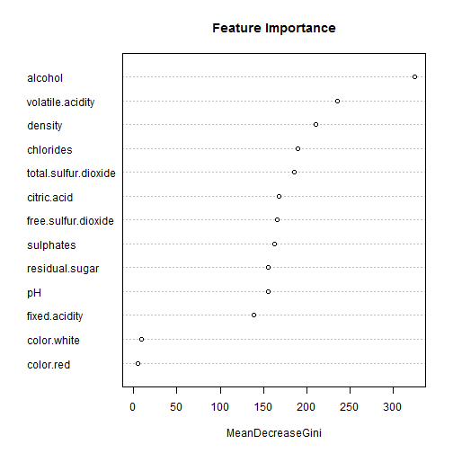

Predicting the Quality of Wine Using Physicochemical Parameters
========================================================
author: Valerii Podymov
date: Jan 2016

Application Structure
========================================================

The aim of the project is to explore the Random Forest technique in predicting of the quality of wines using physicochemical parameters.

The application has the following tabs:

* _Data Set_ displays a table with final clean dataset
* _Exploratory Data Analysis_ shows how the quantitative variables normalized to be within the [0,1] range are distributed
* _Random Forest_ demonstrates the results of predicting the quality of wine using the Random Forest classifier. A user can select the model parameters using intuitive UI.
* _About_ gives details on the Wine Quality UCI Machine Learning dataset

Data Set
========================================================
Original Data are the [Wine Quality UCI Machine Learning dataset](http://archive.ics.uci.edu/ml/datasets/Wine+Quality)


```r
str(wines)
```

```
'data.frame':	6497 obs. of  13 variables:
 $ fixed.acidity       : num  7.4 7.8 7.8 11.2 7.4 7.4 7.9 7.3 7.8 7.5 ...
 $ volatile.acidity    : num  0.7 0.88 0.76 0.28 0.7 0.66 0.6 0.65 0.58 0.5 ...
 $ citric.acid         : num  0 0 0.04 0.56 0 0 0.06 0 0.02 0.36 ...
 $ residual.sugar      : num  1.9 2.6 2.3 1.9 1.9 1.8 1.6 1.2 2 6.1 ...
 $ chlorides           : num  0.076 0.098 0.092 0.075 0.076 0.075 0.069 0.065 0.073 0.071 ...
 $ free.sulfur.dioxide : num  11 25 15 17 11 13 15 15 9 17 ...
 $ total.sulfur.dioxide: num  34 67 54 60 34 40 59 21 18 102 ...
 $ density             : num  0.998 0.997 0.997 0.998 0.998 ...
 $ pH                  : num  3.51 3.2 3.26 3.16 3.51 3.51 3.3 3.39 3.36 3.35 ...
 $ sulphates           : num  0.56 0.68 0.65 0.58 0.56 0.56 0.46 0.47 0.57 0.8 ...
 $ alcohol             : num  9.4 9.8 9.8 9.8 9.4 9.4 9.4 10 9.5 10.5 ...
 $ quality             : int  5 5 5 6 5 5 5 7 7 5 ...
 $ color               : Factor w/ 2 levels "red","white": 1 1 1 1 1 1 1 1 1 1 ...
```

Random Forest Model
========================================================



Summary
========================================================
The developed program allows a user to:

- Visualize numerical features distribution 
- Set the training set portion and a number of trees in the model
- Preview the accuracy and variables importance

The Shiny application is located at [http://podval.shinyapps.io/WineQuality/](https://podval.shinyapps.io/WineQuality/)

The sourcecodes are available on [GitHub](http://github.com/vapodymov/DDP)
